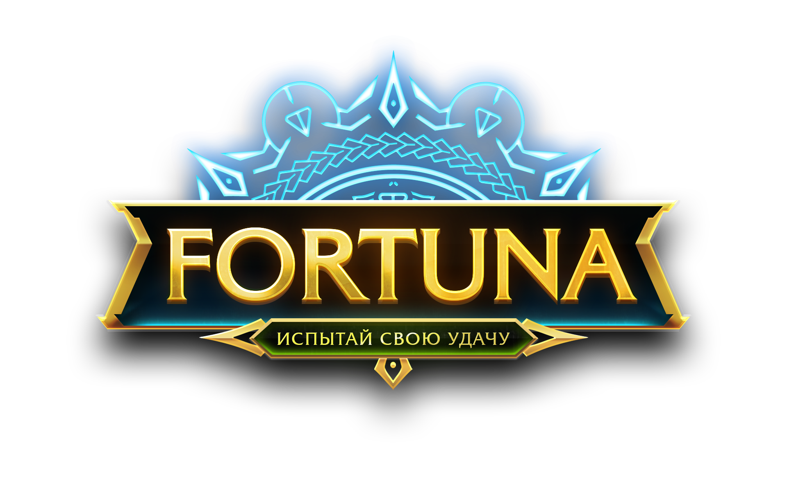
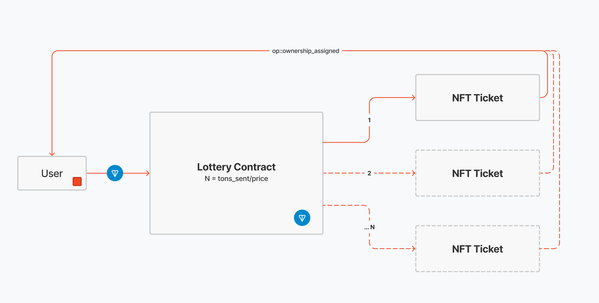

# Fortuna Lottery

Этот репозиторий содержит исходный код смарт-контрактов лотереи Fortuna,
тесты и утилиты к ним (с
[blueprint](https://github.com/ton-community/blueprint)) и объяснение
основных принципов его работы.

## Ползеные ссылки
- [Контракт в mainnet:](https://tonscan.org/address/EQA--JhKKuYfb-WAw7vDWEfD4fg2WOt9AuLH6xHPvF0RTUNA) `EQA--JhKKuYfb-WAw7vDWEfD4fg2WOt9AuLH6xHPvF0RTUNA`
- [Fortuna.run - интерфейс для общения с контрактом](https://fortuna.run)
- [NFT Web3TON - коллекция, холдеры которой получают доход с лотереи](https://web3ton.pro)
- [NFT Web3TON на GetGems](https://getgems.io/collection/EQCdVlYKvCuUaVIWjwlGtQgWvDa8DsbCNEM6hHevSW__-07R)

## Как оно работает

Оператор запускает тираж лотереи, где указывает призовые NFT, цену билета,
время розыгрыша. Эти данные не могут быть изменены вплоть до момента
розыгрыша никем. Покупка билета происходит по обычному переводу на адрес
контракта суммы кратной цене билета. Например: цена билета 2 TON; чтобы
купить один билет, нужно отправить 2 TON, два - 4 TON, три - 6 TON и так
далее. Билет это контракт с интерфейсом (get-методами) NFT. Трансфер
билета может осуществлять только контракт лотереи (NFT коллекции). При
покупке билета, лотерея или минтит новый NFT-билет, или делает участника
владельцем одного из существующих, следующего по счету, билета. 

> Призовой фонд не хранится в контракте суммой. Вместо этого, он может
> быть посчитан в любой момент времени из баланса контракта, количества
> призов и количества купленных в туре билетов.
> [Подробнее](contracts/imports/utils.fc#L53-L59).

Когда истекает установленный оператором таймер, при любом вызове (входящей
транзакции с `op = 0` или без body) контракта будет произведен розыгрыш.
Тогда лотерея выбирает случайные числа - индексы выигравших билетов по
количеству призов и отправляет на них запросы адресов их владельцев.
Вызвавшему контракт адресу возвращаются монеты за вычитом комиссий
с комментарием `Successfully drawn`. Лотерея отправляет 50% призового
фонда на 2 сервисных кошелька (один для рассылки дохода холдерам NFT
Web3TON, другой - для закупки NFT на следующий розыгрыш) и ждет ответа от
контрактов выигрышных билетов.

> Если билетов для розыгрыша не хватает, время розыгрыша увеличивается на
> 2ч и покупка билетов продолжается.

Когда ответ на запрос владельца приходит, лотерея отправляет приз: монеты
из призового пула или трансфер призовой NFT к победителю - владельцу
выигрышного билета. 

После розыгрыша NFT-билеты по get-методу возвращают своим владельцем адрес
лотереи. То есть в идеальном мире как NFT они должны были бы исчезнуть из
кошельков пользователей в момент розыгрыша, но так как индексация
в кошельках происходит постепенно, билеты исчезают не так быстро, как
хотелось бы. Сразу пропадают только выигрышные билеты, потому что они
обработали транзакцию и информация о них была обновлена провайдерами api.

## License

MIT
